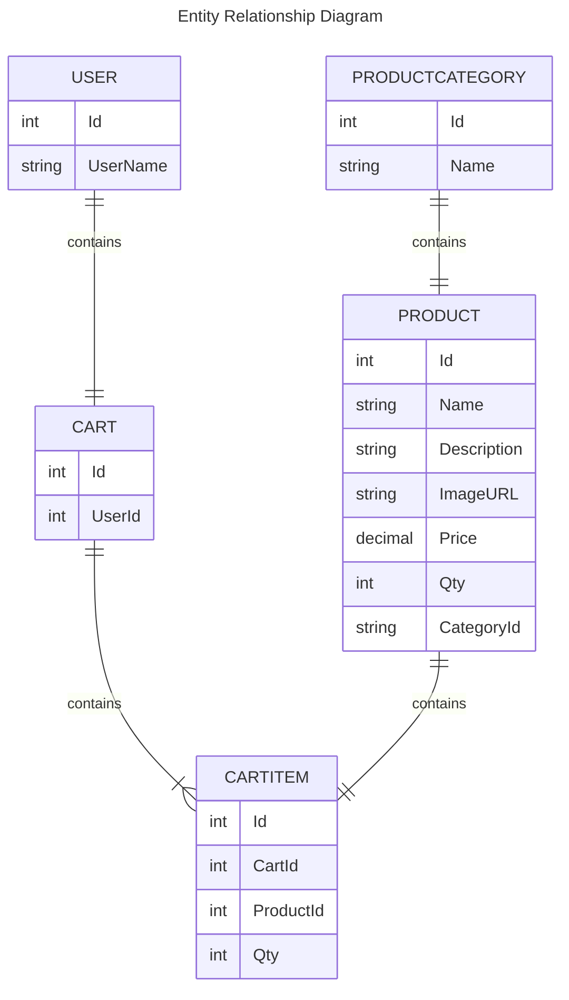

# 1. ShopOnline
---
- [1. ShopOnline](#1-shoponline)
  - [1.1. Overview:](#11-overview)
    - [1.1.1. Alcance(Scope)](#111-alcancescope)
      - [1.1.1.1. Casos de uso](#1111-casos-de-uso)
      - [1.1.1.2. Out of Scope](#1112-out-of-scope)
  - [1.2. Arquitectura](#12-arquitectura)
    - [1.2.1. Diagramas](#121-diagramas)
    - [1.2.2. Modelo de datos](#122-modelo-de-datos)
  - [1.3. Limitaciones](#13-limitaciones)
  - [1.4. Costo](#14-costo)

## 1.1. Overview:
This project creates a web platform where users can buy items online, with cart shopping. Any person can navigate the site and check prices.

- Select items to shopping cart
- Buy one or more than one item
- Pay using Paypal

*put here what the client shared with us*

### 1.1.1. Alcance(Scope)

#### 1.1.1.1. Casos de uso
Description

* As a user I would like to choose one item to my shopping cart
* As a user I would like to delete items from my shopping cart
* As a user I would like to pay with PayPal
* As a user I would like to see the stock by categories
* As a non registered user I would like to choose items in my shopping cart
* ...

*the essential*

#### 1.1.1.2. Out of Scope
Description...
* As a unregisted user i would like to pay for my items by any means (!)
* As a user I would like to delete categories
* As a user I woudd like to upload more items
* ...

## 1.2. Arquitectura

### 1.2.1. Diagramas
poner diagramas de secuencia, uml, etc

### 1.2.2. Modelo de datos

Poner diseño de entidades, Jsons, tablas, diagramas entidad relación, etc..

---

## 1.3. Limitaciones
Lista de limitaciones conocidas. Puede ser en formato de lista.
Ej.
* Llamadas a la API para obtener listas de productos, no excedelos limites de latencia 100ms
* No se soporta mas de X llamadas por segundo

*they need to be quantifiable*
*if the system grows then it could fail, so it is important to have all these details written*

---

## 1.4. Costo
Description and cost analysis
Contemplando 1000 usuarios diarios, que visitan recurrentemente cada hora:
Example:
"Considerando N usuarios diarios, M llamadas a X servicio/baseDatos/etc"
* 1000 llamadas diarias a serverless functions. $XX.XX
* 1000 read/write units diarias a X Database on-demand. $XX.XX
Total: $xx.xx (al mes/dia/año)
